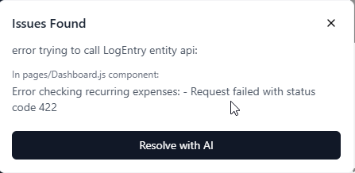

> Let's create the "Reports" page, it should have a series of stats and charts, let's start with:
> 
> - "Total stats" area: Total km, Average Fuel efficiency, max distance between fill-ups, average cost per fill-up, average price/liter.
> - Charts: 
> 	- line chart for fuel price over time.
> 	- pie chart of total expenses grouped by record type.
> 	
> remember to enable the "Reports" button on the main dashboard

> [!NOTE]
> This triggered another error and the fix costed another prompt...

---

> Please note that after any changes we've made during last two days you always found a "React hook dependency issue", please review all the code to avoid having this error every time the app is changed, as this is costing an additional prompt for each iteration.

---

> On "Reports" page, before charts area put a hint for the user with this text "Rotate your device for a better view of all charts", then let's change focus to a new feature: provide an idea to implement "recurring expense" feature: user should be able to flag an expense record as "recurring" specifying the schedule and the app should add that expense autonomously following the schedule.

> [!NOTE]
> Provided a very comprehensive plan to implement the new feature and proposed 3 different phases to proceed, let's see how it goes...

> Yes please proceed with "Phase 1" as you planned

> [!NOTE]
> It implemented the feature and added it to the "settings" page while I would have expected to find it in the "add record" page, anyway, the interface works but as soon as I added an expense with a "start date" in the past (like, the recurring expense started months ago, so now I want to add it in one go) and then refreshed the app it triggered an error that I'll address starting from tomorrow as I finished my daily free prompts...

